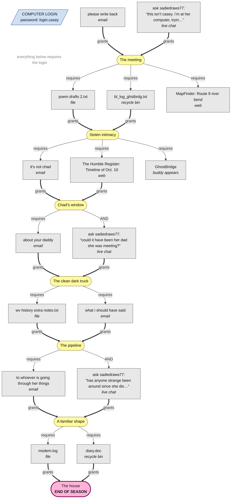

# Clue graph — Last Login — Season 1: Without a Trace

> GENERATED — do not edit. Source of truth: `season1.ts`. Regenerate: `npm run graph`
>
> In-world date: 1997-10-18 · 113 items
> (11 gated · 11 granting · ~91 mundane camouflage) ·
> 7 discoveries

Legend: rectangles are evidence items · stadiums are discoveries · slashed boxes
are password gates · `grants` = opening the item earns the discovery ·
`requires` = the item is invisible until the discovery is earned (AND/OR shown
on multi-requirement edges) · dotted = requires *opening* an item.
